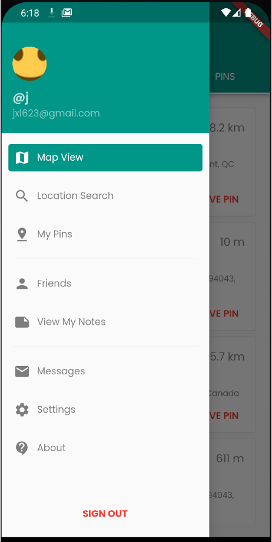
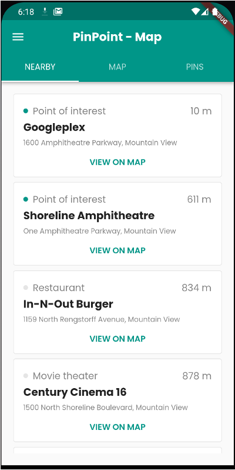
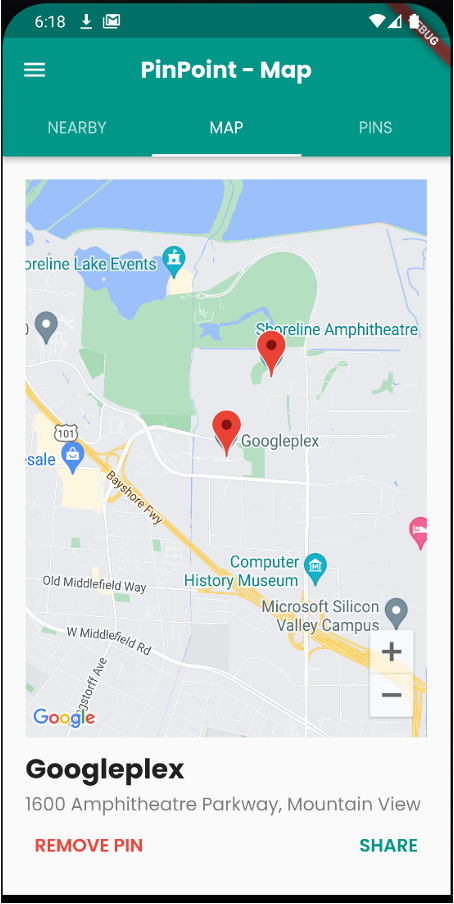
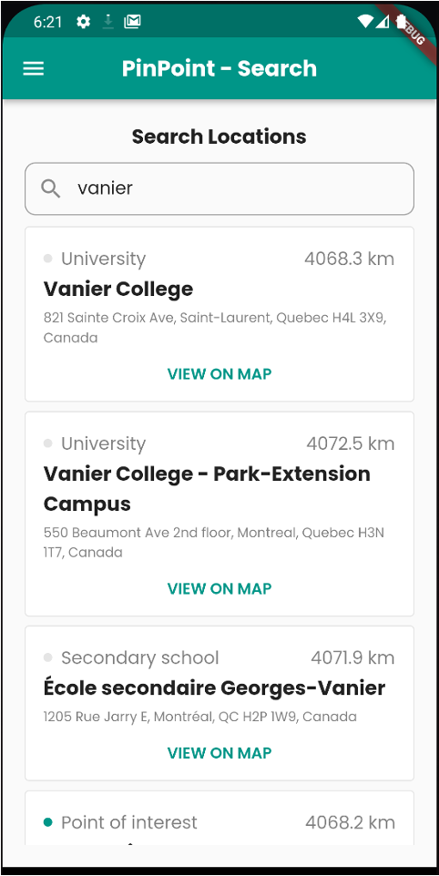
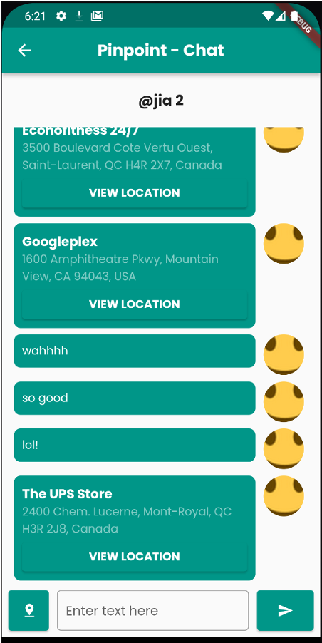

## 📍 PinPoint

A mobile application that mainly focused on allowing users to save locations. Initially inspired by people easily forgetting places they went to. Made with Flutter and Firebase.

Here are some features that this application provides:

-   Authentication
-   Messaging
-   Location sharing
-   Location reviews, through providers

---
## UI Snapshots

Snapshots of some screens are included below. They are all fully responsive.

### Menu

### Map and Search

### Messaging and Sharing

---
## Notes

I have deleted the firebase project, so the application will not run. However, you can still check out the code.

Also, the Google Maps API key used in this project does not belong to me. It is a key I had found online.